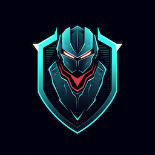

Security Bot - Security checks orchestration tool
=======

The [Security Bot](docs/index.rst) (SecBot) service introduces an additional collection of checks to the SDLC to identify security issues in corporate assets

Reach out to our [Discord server](https://discordapp.com/invite/MqHBT6mg) to communicate with the team more effectively

**Technologies: [FastAPI](https://fastapi.tiangolo.com/), [Celery](https://docs.celeryq.dev/en/stable/) + Redis, [SQLAlchemy](https://www.sqlalchemy.org/) + Postgres, Pytest, and others**

## Installation and Tests

#### For sample k8s manifests please refer to [/k8s](/k8s) directory

Deployment:

    git clone path/to/project.git
    docker-compose up --build

Service configuration:

    .env.dev (Default values)
    .env.override (Customized values)

Workflow configuration:

    app/config.yml

## Usage and Support

Documentation:

* [Project documentation (rtd)](https://security-bot.readthedocs.io/en/latest/)
* [Project documentation (local)](docs/index.rst)
